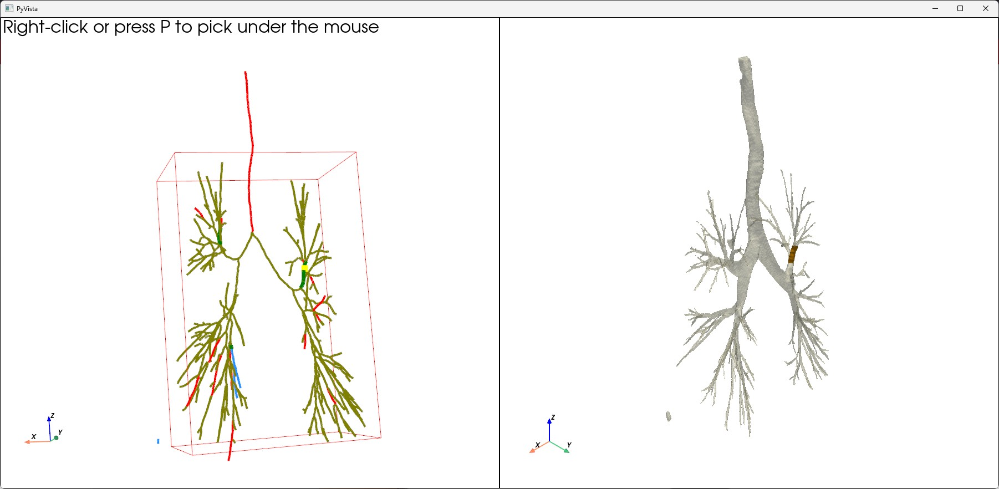

# Interactive Airway Graph Repair

This project extracts an airway skeleton from a segmentation mask (or CT, but this part is TBD), converts it into a graph representation, and provides an interactive interface for inspecting and repairing the graph.

## Requirements

Install the required packages:

```bash
pip install -r requirements.txt
```

## Running the Program

Run the program from the command line using:

```bash
python ./main.py <path_to_segmentation> --input-type <seg or ct>
```

Example:

```bash
python main.py data/airway.nii.gz --input-type seg
```

The segmentation input should be in the format of .nii.gz

---

## Interface Overview

The interface displays three synchronized views:

- **Skeleton View** – Displays the airway skeleton.
- **CT/Voxel View** – Displays the original CT data.

You can rotate, pan, and zoom in each view using the standard mouse controls provided by PyVista.
Left click: rotate, Middle wheel: pan

---

## Interactive Controls

### Cutting an Edge

1. Hover your mouse on an edge in the graph. Press P to cut.*
2. The selected edge will be removed from the graph.
3. If the removed edge disconnects the graph, the program automatically searches for the best reconnection candidate.

*This is to avoid misclick. If you would like to select by purely clicking, set ```left_clicking=False``` to True in ```visualize_graph_and_airway_linked``` in main().

### Automatic Repair

When a repair is possible, the algorithm:

- Identifies the disconnected component.
- Evaluates candidate reconnections using the scoring function.
- Inserts the repair edge based on the score.
- Updates all visualizations automatically.

You will see a red highlight on the CT panel to identify the edge you have modified.



If no suitable repair exists, you will see an error message in the terminal.
